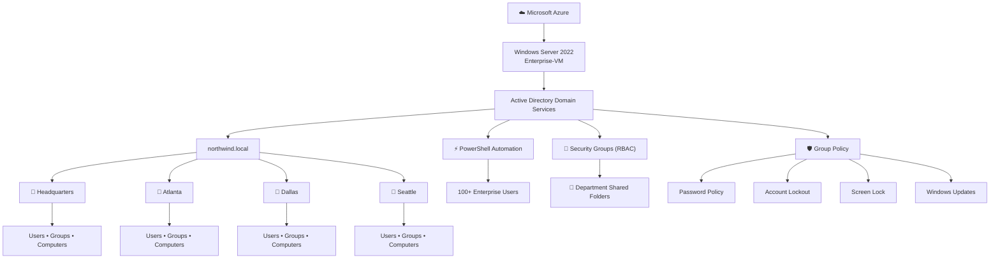

# Enterprise Identity & Access Management Infrastructure in Microsoft Azure

> Designed and implemented a multi-site enterprise Identity & Access Management (IAM) environment in Microsoft Azure using Active Directory Domain Services, PowerShell automation, Group Policy, and Role-Based Access Control (RBAC) to standardize identity management across multiple office locations.

---

## Business Problem

As organizations grow, managing user identities, permissions, and security manually becomes increasingly difficult. Inconsistent account provisioning, unmanaged permissions, and the lack of centralized security policies increase administrative overhead while introducing unnecessary security risks.

Northwind Technologies expanded from a single office to over 100 employees across four locations. The organization required a centralized identity management solution capable of standardizing user provisioning, enforcing security policies, and securing access to departmental resources.

This project demonstrates how Microsoft Azure and Active Directory can be used to build an enterprise Identity & Access Management solution that scales with organizational growth.

---

# Solution

To address these challenges, I designed and deployed a centralized Active Directory environment hosted in Microsoft Azure.

The environment includes:

- Multi-site Active Directory infrastructure
- Standardized Organizational Unit (OU) design
- Automated user provisioning using PowerShell
- Role-Based Access Control (RBAC)
- Departmental shared folders secured through Security Groups
- Centralized security configuration using Group Policy

---

# Architecture

---

# Key Engineering Decisions

## 1. Standardized Enterprise Directory Structure

Instead of organizing users in a single directory, I designed a scalable Organizational Unit (OU) hierarchy for Headquarters, Atlanta, Dallas, and Seattle. Each location contains dedicated OUs for users, groups, and computers along with departmental OUs for IT, Finance, HR, Sales, Engineering, Operations, Marketing, Accounting, and Help Desk.

**Why?**

A standardized directory structure simplifies administration, enables delegated management, and provides a scalable foundation for future Group Policy deployment.

---

## 2. Automated User Provisioning

Rather than manually creating more than 100 employee accounts, I automated the provisioning process using PowerShell and CSV imports.

Each account is automatically configured with standardized attributes including:

- Department
- Job Title
- Manager
- Company
- Description
- Organizational Unit

**Why?**

Automation reduces administrative effort, minimizes human error, and ensures every employee account follows a consistent organizational standard.

---

## 3. Role-Based Access Control (RBAC)

Instead of assigning permissions directly to users, departmental Security Groups were created for every office location.

Shared folders are secured by assigning permissions exclusively to Security Groups.

**Why?**

Managing permissions through Security Groups improves scalability, simplifies user lifecycle management, and follows the Principle of Least Privilege.

---

# Technologies

| Category | Technologies |
|-----------|--------------|
| Cloud | Microsoft Azure |
| Identity | Active Directory Domain Services |
| Operating System | Windows Server 2022 Datacenter: Azure Edition |
| Automation | PowerShell |
| Networking | Azure Virtual Network, DNS, DHCP |
| Security | Group Policy, RBAC, NTFS Permissions |
| Administration | Active Directory Users & Computers, Group Policy Management |

---

# Project Highlights

- Designed a multi-site Active Directory environment supporting four office locations.
- Created and managed over 100 enterprise user accounts.
- Automated user provisioning using PowerShell and CSV imports.
- Implemented Role-Based Access Control using Active Directory Security Groups.
- Configured departmental shared folders secured through NTFS and Share Permissions.
- Implemented enterprise Group Policy Objects for password security, account lockout, Windows Updates, USB storage restrictions, and workstation security.

---

# Documentation

Detailed implementation guides for each phase of the project are available below.

| Documentation | Description |
|--------------|-------------|
| Azure Infrastructure | Deploying the Azure environment |
| Enterprise Directory Design | Organizational Unit design and enterprise structure |
| PowerShell Automation | Automated user provisioning using CSV imports |
| Security Groups | Role-Based Access Control implementation |
| Shared Folders | Departmental file shares and NTFS permissions |
| Group Policy | Enterprise security policy configuration |
| Lessons Learned | Project outcomes and future improvements |

---

# Skills Demonstrated

- Microsoft Azure
- Windows Server Administration
- Active Directory Domain Services
- Identity & Access Management (IAM)
- Organizational Unit Design
- PowerShell Automation
- Group Policy Management
- Role-Based Access Control (RBAC)
- NTFS & Share Permissions
- Enterprise Systems Administration

---

# Future Improvements

Potential enhancements include:

- Deploying Windows 11 domain-joined client workstations
- Implementing Microsoft Entra ID hybrid identity
- Deploying Windows Server Update Services (WSUS)
- Configuring Distributed File System (DFS)
- Integrating Azure Monitor and Microsoft Defender for Cloud
- Automating infrastructure deployment with Infrastructure as Code (IaC)

---

> This project was developed to simulate the design and administration of an enterprise Windows environment while demonstrating cloud infrastructure, identity management, security administration, and automation using Microsoft Azure.
